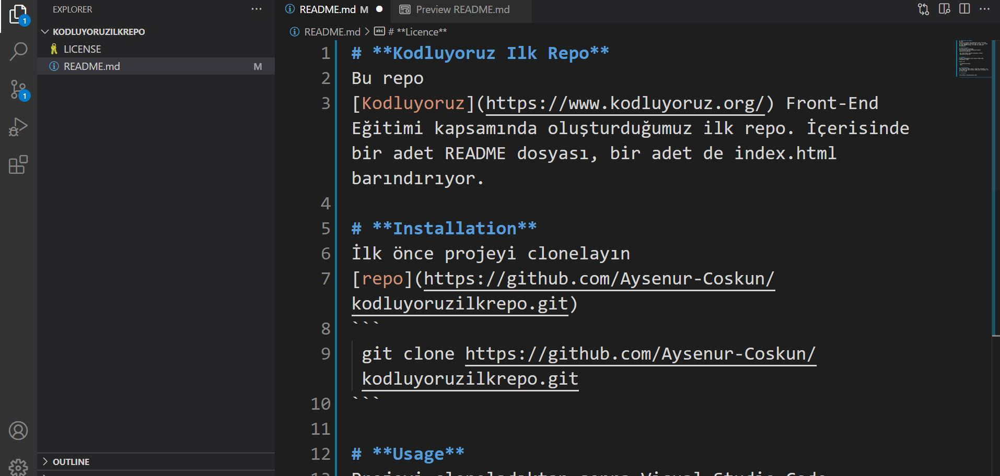

# **Kodluyoruz Ilk Repo**
Bu repo 
[Kodluyoruz](https://www.kodluyoruz.org/) Front-End Eğitimi kapsamında oluşturduğumuz ilk repo. İçerisinde bir adet README dosyası, bir adet de index.html barındırıyor.

# **Installation**
İlk önce projeyi clonelayın
[repo](https://github.com/Aysenur-Coskun/kodluyoruzilkrepo.git)
```
 git clone https://github.com/Aysenur-Coskun/kodluyoruzilkrepo.git
```

# **Usage**
Projeyi cloneladıktan sonra Visual Studio Code programında açınız.

Linux için:
 ```
 cd kodluyoruzilkrepo
 code .
```

# **Contributing**
Pull requestler kabul edilir. Büyük değişiklikler için, lütfen önce neyi değiştirmek istediğinizi tartışmak için bir konu açınız

# **Licence**

[MIT](https://choosealicense.com/)


